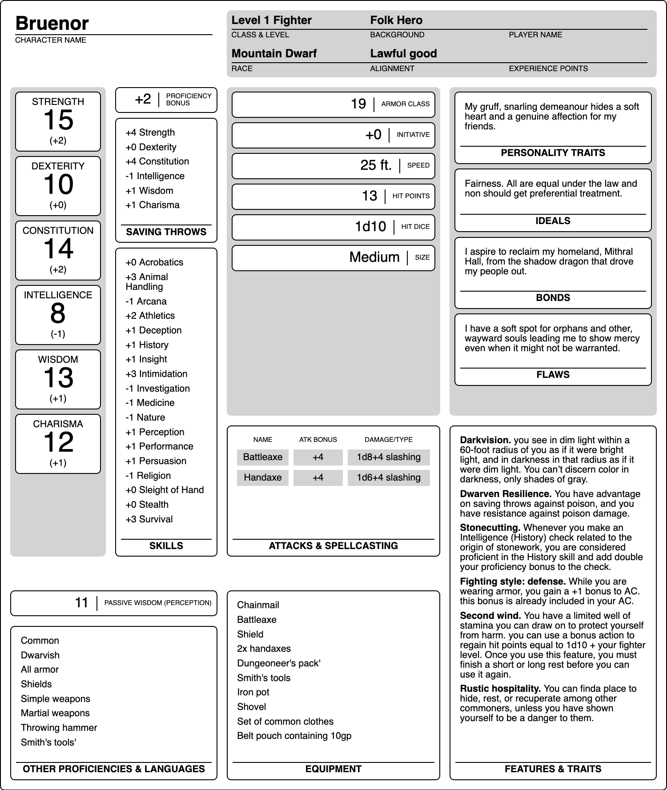

# &lt;vellum-sheet&gt; [](https://travis-ci.org/grislyeye/vellum-sheet)

Web component for displaying RPG sheets and 5th Edition RPG character sheets. Features include:

  * Cross-browser support using Polymer and the Web Components polyfill
  * Simpler (just one import vs 5)
  * Theme-able



To install:

```sh
npm i --save vellum-sheet
```

Add the following lines to your HTML `head` element:

```html
<script type="module" src="vellum-char-sheet.js"></script>
```

A character sheet is written as follows:

```html
<vellum-char-sheet id="bruenor" itemscope itemtype="http://grislyeye.github.io/vellum-char-sheet-schemas/character.html">

  <header>
    <h1 itemprop="name">Bruenor</h1>
  </header>

  <section>
    <dl>
      <dt>Class</dt><dd itemprop="class">Fighter</dd>
      <dt>Level</dt><dd itemprop="level">1</dd>
      <dt>Race</dt><dd itemprop="race">Mountain Dwarf</dd>
      <dt>Background</dt><dd itemprop="background">Folk Hero</dd>
      <dt>Alignment</dt><dd itemprop="alignment">Lawful good</dd>
    </dl>
  </section>

  <section>
    <dl>
      <dt>Strength</dt><dd itemprop="strength">15</dd>
      <dt>Dexterity</dt><dd itemprop="dexterity">10</dd>
      <dt>Constitution</dt><dd itemprop="constitution">14</dd>
      <dt>Intelligence</dt><dd itemprop="intelligence">8</dd>
      <dt>Wisdom</dt><dd itemprop="wisdom">13</dd>
      <dt>Charisma</dt><dd itemprop="charisma">12</dd>
    </dl>
  </section>

  <section>
    <ul>
      <li itemprop="skills">Animal Handling</li>
      <li itemprop="skills">History</li>
      <li itemprop="skills">Intimidation</li>
      <li itemprop="skills">Survival</li>
    </ul>
  </section>

  <section>
    <ul>
      <li itemprop="saving-throws">Strength</li>
      <li itemprop="saving-throws">Constitution</li>
    </ul>
  </section>

  <section>
    <ul>
      <li itemprop="ac">19</li>
      <li itemprop="max-hit-points">13</li>
      <li itemprop="hit-dice">d10</li>
      <li itemprop="size">Medium</li>
      <li itemprop="speed">25</li>
    </ul>
  </section>

  <section>
    <ul>
      <li itemscope itemprop="features"><span itemprop="name">Darkvision.</span> <span itemprop="description">you see in dim light within a 60-foot radius of you as if it were bright light, and in darkness in that radius as if it were dim  light. You can’t discern color in darkness, only  shades of gray.</span></li>
      <li itemscope itemprop="features"><span itemprop="name">Dwarven Resilience.</span> <span itemprop="description">You have advantage on saving throws against poison, and you have resistance against poison damage.</span></li>
      <li itemscope itemprop="features"><span itemprop="name">Stonecutting.</span> <span itemprop="description">Whenever you make an  Intelligence (History) check related to the  eP origin of stonework, you are considered proficient in the History skill and add double your proficiency bonus to the check.</span></li>
      <li itemscope itemprop="features"><span itemprop="name">Fighting style: defense.</span> <span itemprop="description">While you are wearing armor, you gain a +1 bonus to AC. this bonus is already included in your AC.</span></li>
      <li itemscope itemprop="features"><span itemprop="name">Second wind.</span> <span itemprop="description">You have a limited well of stamina you can draw on to protect yourself from harm. you can use a bonus action to regain hit points equal to 1d10 + your fighter level. Once you use this feature, you must finish a short or long rest before you can use it again.</span></li>
      <li itemscope itemprop="features"><span itemprop="name">Rustic hospitality.</span> <span itemprop="description">You can finda  place to hide, rest, or recuperate among other commoners, unless you have shown yourself to be a danger to them.</span></li>
    </ul>
  </section>

  <section>
    <ul>
      <li itemprop="other-proficiencies">Common</li>
      <li itemprop="other-proficiencies">Dwarvish</li>
      <li itemprop="other-proficiencies">All armor</li>
      <li itemprop="other-proficiencies">Shields</li>
      <li itemprop="other-proficiencies">Simple weapons</li>
      <li itemprop="other-proficiencies">Martial weapons</li>
      <li itemprop="other-proficiencies">Throwing hammer</li>
      <li itemprop="other-proficiencies">Smith's tools'</li>
    </ul>
  </section>

  <section>
    <ul>
      <li itemprop="equipment">Chainmail</li>
      <li itemprop="equipment">Battleaxe</li>
      <li itemprop="equipment">Shield</li>
      <li itemprop="equipment">2x handaxes</li>
      <li itemprop="equipment">Dungeoneer's pack'</li>
      <li itemprop="equipment">Smith's tools</li>
      <li itemprop="equipment">Iron pot</li>
      <li itemprop="equipment">Shovel</li>
      <li itemprop="equipment">Set of common clothes</li>
      <li itemprop="equipment">Belt pouch containing 10gp</li>
    </ul>
  </section>

  <section>
    <ul>
      <li itemscope itemprop="attacks"><span itemprop="name">Battleaxe</span> <span itemprop="damage">1d8</span> <span itemprop="type">slashing</span> (<data itemprop="proficient" value="true">proficient</data>)</li>
      <li itemscope itemprop="attacks"><span itemprop="name">Handaxe</span> <span itemprop="damage">1d6</span> <span itemprop="type">slashing</span> (<data itemprop="proficient" value="true">proficient</data>)</li>
    </ul>
  </section>

  <section>
    <div>
      <h2>Personality Traits</h2>
      <p itemprop="personality-traits">My gruff, snarling demeanour hides a soft heart and a genuine affection for my friends.</p>
    </div>

    <div>
      <h2>Ideals</h2>
      <p itemprop="ideals">Fairness. All are equal under the law and non should get preferential treatment.</p>
    </div>

    <div>
      <h2>Bonds</h2>
      <p itemprop="bonds">I aspire to reclaim my homeland, Mithral Hall, from the shadow dragon that drove my people out.</p>
    </div>

    <div>
      <h2>Flaws</h2>
      <p itemprop="flaws">I have a soft spot for orphans and other, wayward souls leading me to show mercy even when it might not be warranted.</p>
    </div>
  </section>

</vellum-char-sheet>
```

Custom CSS properties for this component include:

| Property                               | Description
| -------------------------------------- | ---
| `--char-sheet-border-color`            | Colour of the border line around sheet.

## Custom Sheets

You can define your own custom sheets using the `<vellum-sheet>` and `<vellum-sheet-box>` custom elements:

```html
<vellum-sheet>
  <vellum-sheet-box label="Box 1">
    <ul>
      <li>Box content 1</li>
      <li>Box content 2</li>
      <li>Box content 3</li>
      <li>Box content 4</li>
    </ul>
  </vellum-sheet-box>
</vellum-sheet>
```

You should also order the contents of your custom sheet into columns yourself, preferably using [CSS Grid Layout](https://developer.mozilla.org/en-US/docs/Web/CSS/CSS_Grid_Layout):

```css
vellum-sheet.custom {
  display: grid;
  grid-template-columns: 50% 50%;
  width: 750px;
  height: 750px;
}
```

Custom sheets can be composed on the following helper elements:

## &lt;vellum-sheet-box&gt;

A sheet box is a bordered container for any content, typically a list of items:

```html
<vellum-sheet-box label="Box Title">
  <ul>
    <li>Box content 1</li>
    <li>Box content 2</li>
    <li>Box content 3</li>
    <li>Box content 4</li>
  </ul>
</vellum-sheet-box>
```

## Hacking

Requirements:

  * [Node.js](http://nodejs.org/)

To set-up your environment execute:

    $ npm install

To run linting and test:

    $ npm test

To run local demo:

    $ npm run start
